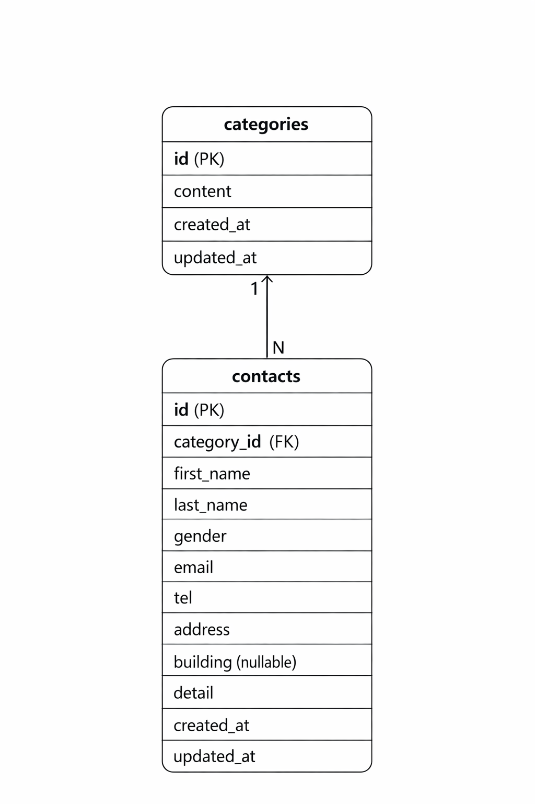

# お問い合わせフォーム

## 環境構築

### Dockerビルド

```
docker-compose up -d --build
```

### Laravel環境構築

```
docker-compose exec php bash
composer install
cp .env.example .env
php artisan key:generate
php artisan migrate:fresh --seed
```

---

## 開発環境URL

- お問い合わせ入力画面：http://localhost/
- 会員登録：http://localhost/register
- ログイン：http://localhost/login
- 管理画面：http://localhost/admin
- phpMyAdmin：http://localhost:8080/

---

## テスト用ログイン情報

email: admin@example.com
password: password

---

## 使用技術（実行環境）

- PHP 8.1.34
- Laravel 10.50.2
- MySQL 8.x
- nginx
- Docker / docker-compose

---

## ER図


